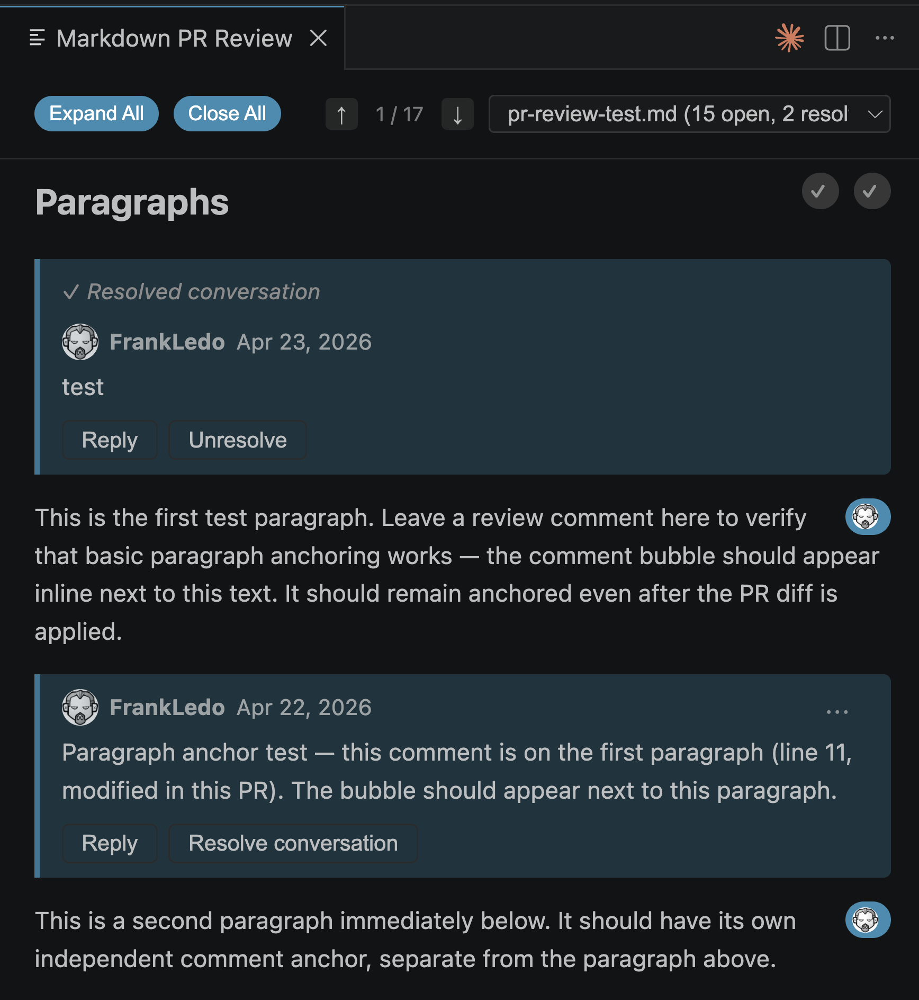

# Markdown PR Review

Read and review GitHub Pull Request comments on rendered markdown — right inside VS Code.

## The problem

Reviewing long-form markdown (design docs, RFCs, runbooks, architecture notes) through a GitHub PR is painful. The diff view shows raw syntax. The rendered preview and the review comments live in separate places. You end up bouncing between tabs, losing context with every switch.

## What this does

Opens a rendered preview of your markdown file with GitHub PR comment threads overlaid inline — anchored to the exact rendered element they were left on. No raw syntax. No tab switching.



## Features

- **Inline comment threads** anchored to the rendered line via source maps
- **Comment on any line** — select any text, even outside the diff; the comment anchors to the nearest changed line and the original line is noted in the comment body
- **Full thread lifecycle** — reply, edit, delete, resolve, unresolve
- **Draft review batching** — accumulate comments and submit as one review
- **File switcher** — jump between all markdown files in the PR from the header dropdown
- **Navigation strip** — ↑↓ buttons and `[` / `]` keyboard shortcuts to move between threads; Expand All / Close All controls
- **Mermaid diagram support** — comments anchor to the fence block; diagrams render in VS Code's light or dark theme
- **YAML front matter** rendered as a styled key-value block
- **GitHub authentication** via VS Code's built-in auth — no setup required

## Usage

1. Switch to a PR branch in a repository with an open GitHub PR
2. Click the **$(comment-discussion) PR #N** item in the status bar (bottom right), or run `Open PR Review` from the Command Palette (`Ctrl+Shift+P` / `Cmd+Shift+P`), or right-click any markdown file → **Open PR Review**
3. Browse the rendered preview with comment threads overlaid inline

## Authentication

Uses VS Code's built-in GitHub authentication — you'll be prompted to sign in on first use. No configuration needed.

## Requirements

VS Code 1.85 or later.

## Install

Search **Markdown PR Review** in the Extensions view, or install from the command line:

```bash
code --install-extension frankledo.markdown-pr-review
```

## License

[MIT](LICENSE)
