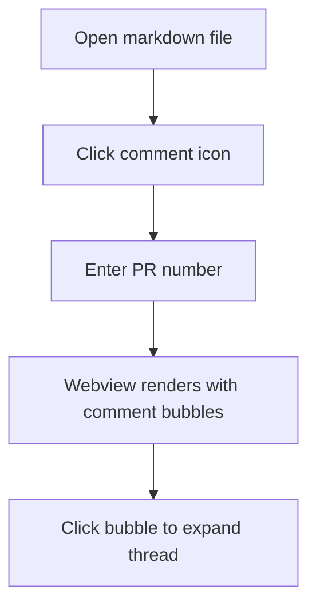

# Test Fixture

This file exists to test the Markdown PR Review extension. It is not documentation.

## Table of Contents

- [Overview](#overview)
- [Checklist](#checklist)
- [Diagram](#diagram)
- [Edge Cases](#edge-cases)

## Overview

This section tests that TOC links work — clicking the links above should scroll to the correct heading.

Leave a review comment on this paragraph to test basic comment anchoring.

## Checklist

- [ ] TOC links scroll to the correct heading
- [ ] Comment bubbles appear at the right line
- [ ] Threads can be expanded and collapsed
- [ ] Reply, edit, delete, resolve all work
- [ ] Draft review batching works

## Diagram

The following Mermaid diagram should render, not show raw code, and accept comments anchored to the fence block.

## Edge Cases

This section tests tricky cases.

A paragraph immediately followed by another with no blank line.
Like this one — both should get separate `data-line` anchors.

> A blockquote. Comments anchored here should land on the blockquote, not a surrounding paragraph.

A list right after a heading:

1. First item — comment here
2. Second item — comment here too
3. Third item
