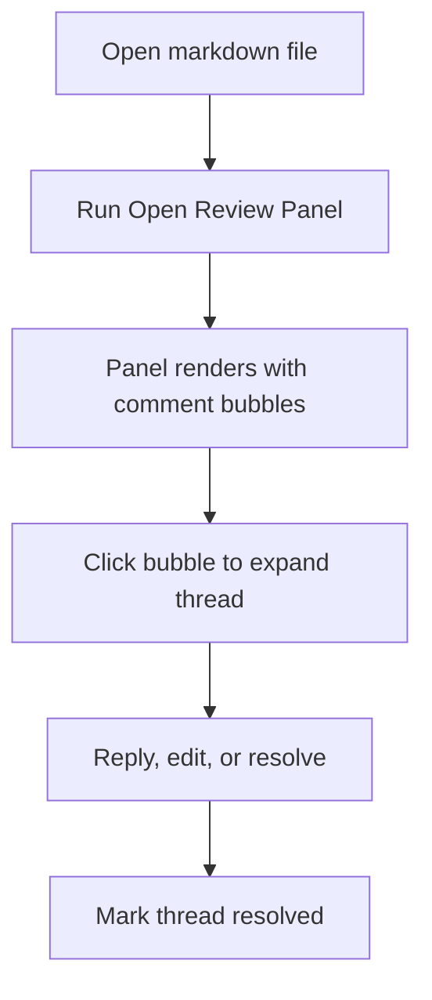

# PR Review Test Fixture

This file is the permanent manual test fixture for the Markdown PR Review extension.
It covers every element type the renderer supports. Open a PR that modifies this file,
then use that PR's number to spot-check comment anchoring for each section.

## Contents

- [Paragraphs](#paragraphs)
- [Headings](#headings)
- [Unordered List](#unordered-list)
- [Ordered List](#ordered-list)
- [Fenced Code Block](#fenced-code-block)
- [Mermaid Diagram](#mermaid-diagram)
- [Blockquote](#blockquote)
- [Table](#table)
- [Edge Cases](#edge-cases)

## Paragraphs

This is the first test paragraph. Leave a review comment here to verify that basic
paragraph anchoring works — the comment bubble should appear inline next to this text.
It should remain anchored even after the PR diff is applied.

This is a second paragraph immediately below. It should have its own independent
comment anchor, separate from the paragraph above.

A third paragraph with **bold text**, _italic text_, and `inline code` mixed in.
Comment anchoring should still work when the paragraph contains inline formatting.

## Headings

### H3 Heading

Comments anchored to a heading should appear next to the heading text, not the
paragraph that follows it.

#### H4 Heading

A deeper heading to verify that anchor depth doesn't affect comment placement.

## Unordered List

- First item — leave a comment here
- Second item — leave a comment here
  - Nested item — verify nested list anchoring
  - Another nested item
- Third item
- Fourth item — added in this PR

## Ordered List

1. First step — comment here to verify ordered list anchoring
2. Second step
3. Third step
   1. Nested step
   2. Another nested step
4. Fourth step

## Fenced Code Block

```typescript
function greet(name: string): string {
  return `Hello, ${name}!`;
}

const result = greet('world');
console.log(result);
```

Comment anchored to a fenced code block should land on the block itself,
not the surrounding text.

## Mermaid Diagram



Comments on a Mermaid diagram anchor to the fence block (the whole diagram),
not to an individual node — matching GitHub's own behaviour.

## Blockquote

> This is a blockquote. It should be independently commentable. The comment
> bubble should appear at the start of the quote block, not at the surrounding paragraph.

Text after the blockquote, to confirm the blockquote and this paragraph get separate anchors.

## Table

| Feature | Status | Notes |
|---|---|---|
| Inline threads | ✅ Done | Anchored via source maps |
| Draft batching | ✅ Done | Submit as one review |
| File switcher | ✅ Done | Dropdown in header |
| Mermaid support | ✅ Done | Anchors to fence block |
| Scroll sync | 🚧 Planned | Phase 4 |

## Edge Cases

Adjacent paragraph without a blank line between.
This second line of adjacent text — both lines belong to the same paragraph token.

A paragraph followed immediately by a list:
- Item one
- Item two

> A blockquote followed immediately by another:
> Second blockquote line.

Final paragraph with no trailing newline.

An additional edge case paragraph added by this PR to verify that new content at end-of-file anchors correctly.